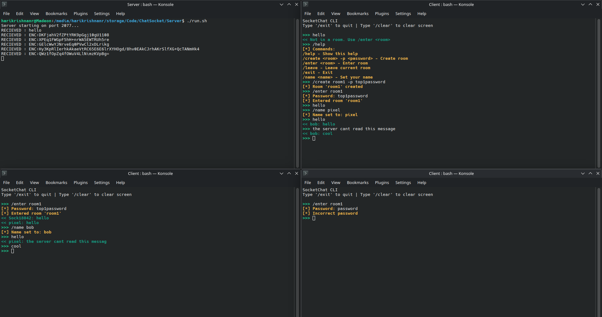

# ChatSocket

A multi-room, end-to-end encrypted chat server application written in C. Features password-protected rooms, client-side encryption, and secure message broadcasting.
Huge thanks to [STUDevLantern](https://www.youtube.com/@STUDevLantern) on Youtube for making [this](https://www.youtube.com/playlist?list=PLu_a4hjJo1mTiX7v_Uj2TixvjXsNsY7SZ) course on Socket Programming.

## Overview

ChatSocket is a TCP-based chat application that enables multiple users to communicate in separate chat rooms with end-to-end encryption. The server handles room management and message routing, while encryption/decryption occurs entirely on the client side, ensuring that messages remain encrypted during transmission.

## Features

- **Multi-room Support**: Create and join multiple chat rooms
- **End-to-End Encryption**: Messages encrypted client-side using AES-256-CTR
- **Password-Protected Rooms**: Secure rooms with salted and hashed passwords
- **Room-Based Key Derivation**: Each room derives encryption keys from user-provided passwords
- **Concurrent Connections**: Multi-threaded server supporting up to 32 simultaneous clients
- **Command Interface**: Simple command-based interaction for room management
- **Automatic Cleanup**: Inactive rooms automatically cleaned up after 1 hour

## Screenshot:


## Technical Architecture

### Cryptographic Implementation

#### Encryption
- **Algorithm**: AES-256-CTR (Counter Mode)
- **Key Derivation**: SHA-256 hash of room password
- **IV Generation**: Random 16-byte initialization vector per message
- **Message Format**: `ENC:<base64-encoded-ciphertext>`

#### Password Storage
- **Hashing**: SHA-256 with 10,000 iterations
- **Salt**: 16-byte random salt per room
- **Format**: `<salt_hex>:<hash_hex>`
- **Constant-Time Comparison**: Protection against timing attacks

#### SHA-256 Implementation
The SHA-256 implementation is based on the work from [Lulu's Blog on Lucidar](https://lucidar.me/en/dev-c-cpp/sha-256-in-c-cpp/), with modifications to suit the specific requirements of this application.

### Network Architecture

- **Protocol**: TCP/IPv4
- **Default Port**: Currently 2077, Configurable via `PORT` environment variable, 
- **Message Size**: 1024 bytes maximum, also configurable by changing memory allocation
- **Connection Model**: One thread per client connection on the server side. On the client side 2 threads are active: 1 for sending and 1 for receiving messages.

### Server Components

#### Room Management
- Maximum 50 concurrent rooms
- Maximum 32 members per room
- Automatic cleanup of inactive rooms (1 hour timeout)
- Password verification with constant-time comparison

#### Client Handling
- Thread-per-client model with detached threads
- Mutex-protected shared state
- Command parsing and routing
- Message broadcasting within rooms

### Client Components

#### Message Processing
- Separate receive thread for asynchronous message handling
- Color-coded message display (cyan for messages, red for errors, yellow for notifications)
- Automatic encryption detection and decryption
- Base64 encoding/decoding for binary data transmission

#### Encryption State
- Per-room encryption context
- Key derivation on room entry
- Automatic encryption for messages in protected rooms

## Project Structure

```
ChatSocket/
├── Client/
│   ├── client.c           # Client implementation
│   ├── client             # Compiled client binary
│   └── run.sh             # Client build and run script
├── Server/
│   ├── server.c           # Server implementation
│   ├── server             # Compiled server binary
│   └── run.sh             # Server build and run script
├── Utils/
│   ├── aes.c              # AES encryption implementation
│   ├── aes.h              # AES header
│   ├── sha256.c           # SHA-256 implementation
│   ├── sha256.h           # SHA-256 header
│   ├── socketUtil.c       # Socket utilities and room management
│   └── socketUtil.h       # Socket utilities header
├── Dockerfile             # Container configuration
└── README.md              # This file
```

## Dependencies

### Server
- POSIX threads (pthread)
- Standard C library
- POSIX sockets

### Client
- POSIX threads (pthread)
- OpenSSL (libssl, libcrypto) - for AES operations
- Standard C library
- POSIX sockets

## Building and Running

### Server

```bash
cd Server
gcc server.c ../Utils/socketUtil.c ../Utils/sha256.c -o server -lpthread
./server
```

Or use the provided script:
```bash
cd Server
./run.sh
```

The server listens on `0.0.0.0` and the port specified by the `PORT` environment variable (default is defined in `socketUtil.h`).

### Client

```bash
cd Client
gcc client.c ../Utils/socketUtil.c ../Utils/sha256.c ../Utils/aes.c -o client -lpthread -lssl -lcrypto
./client
```

Or use the provided script:
```bash
cd Client
./run.sh
```

The client connects to `127.0.0.1` by default. Modify the `IP` variable in `client.c` to connect to a remote server.

## Usage

### Commands

- `/help` - Display available commands
- `/name <username>` - Set your display name
- `/create <room> -p <password>` - Create a password-protected room
- `/create <room>` - Create a public room (no encryption)
- `/enter <room>` - Enter a room (prompts for password if protected)
- `/leave` - Leave current room
- `/clear` - Clear the terminal screen
- `/exit` - Disconnect from server

### Workflow Example

1. Start the server:
   ```bash
   cd Server && ./run.sh
   ```

2. Start a client and set your name:
   ```
   cd Client && ./run.sh
   >>> /name Alice
   ```

3. Create an encrypted room:
   ```
   >>> /create <room_name> -p <password>
   ```

4. Enter the room (another client):
   ```
   >>> /enter <room_name>
   Password: <password>
   ```

5. Send encrypted messages:
   ```
   >>> Hello, this message is encrypted!
   ```
   **What the server sees (example)**: ENC:28Oeb/zdl2c4FIbmud/XtpIU78NLWOjXb+ru2ftS05B5DBkR8FHkrdhSGYb0wFLp
    


### Message Flow

1. **Plaintext Message**: User types a message
2. **Encryption**: Client encrypts message with room key using AES-256-CTR
3. **Encoding**: Encrypted data is base64-encoded
4. **Transmission**: Sent as `ENC:<encoded-data>`
5. **Server Routing**: Server broadcasts encrypted message to room members
6. **Reception**: Receiving clients decode and decrypt the message
7. **Display**: Decrypted message displayed to user

## Security Considerations

### Strengths
- End-to-end encryption ensures server cannot read message content
- AES-256-CTR provides strong encryption
- Salted password hashing with 10,000 iterations
- Constant-time password comparison prevents timing attacks
- Random IV generation for each message

### Limitations
- Shared room passwords mean all room members have the same decryption key
- No forward secrecy - compromised password reveals all past messages
- No authentication of message origin
- No key exchange mechanism, the clients have to pre agree on password
- No protection against replay attacks
- Server can log encrypted messages
- Metadata (usernames, timestamps, room membership) not protected

## Implementation Notes

### AES Implementation
The AES encryption functionality is implemented from scratch using OpenSSL's EVP interface for cryptographic operations. The implementation uses AES-256 in CTR (Counter) mode, which provides:
- Stream cipher-like properties
- No padding requirements
- Parallel encryption/decryption capability

### SHA-256 Implementation
Based on the SHA-256 implementation from Lucidar, with the following modifications:
- Integration with password hashing system
- Support for iterative hashing (PBKDF2-like)
- Constant-time comparison for security
- Salt generation and verification functions

### Threading Model
- Server uses one thread per client connection
- Client uses a separate thread for receiving messages
- All threads are detached for automatic cleanup
- Mutex locks protect shared server state
- Mutex locks are also used for printing to the console in both server and client side.

### Memory Management
- Dynamic allocation for clients and rooms
- Proper cleanup on connection termination
- Zero-out sensitive data after use (passwords, keys)

## Compilation Flags

### Recommended Flags for Production
```bash
gcc -Wall -Wextra -O2 -D_FORTIFY_SOURCE=2 -fstack-protector-strong \
    server.c ../Utils/socketUtil.c ../Utils/sha256.c \
    -o server -lpthread
```

For the client, add OpenSSL linking:
```bash
gcc -Wall -Wextra -O2 -D_FORTIFY_SOURCE=2 -fstack-protector-strong \
    client.c ../Utils/socketUtil.c ../Utils/sha256.c ../Utils/aes.c \
    -o client -lpthread -lssl -lcrypto
```

## Known Issues

- Server does not validate maximum message length strictly
- No rate limiting on connections or messages
- Room cleanup thread runs every 10 minutes regardless of activity
- Client does not handle server disconnection gracefully
- No reconnection logic

## Future Enhancements
- Implement proper key exchange protocol (Diffie-Hellman)
- Implement forward secrecy with ephemeral keys
- Add TLS/SSL for transport layer security
- Add message timestamps and sequence numbers
- Add message authentication and integrity verification
- Support for file transfers
- Persistent message history (SQL)
- User authentication system
- Rate limiting and anti-spam measures
- IPv6 support
- Configuration file support
- Logging system
- Admin commands for room management

## License

This project is provided as-is for educational purposes.

## Credits

- SHA-256 implementation based on work by [Lucidar](https://lucidar.me/en/dev-c-cpp/sha-256-in-c-cpp/)
- AES implementation using OpenSSL EVP interface
- C standard library and berkley sockets

## Contributing

Contributions are welcome. Please ensure code follows the existing style and includes appropriate error handling.
